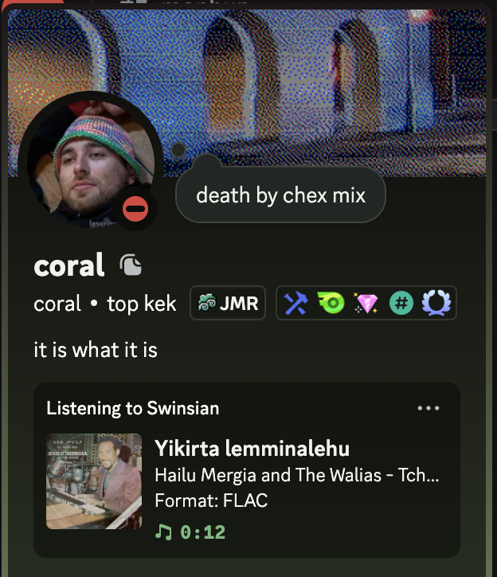

# Swoncord - Discord rich presence for Swinsian

2 years ago I wrote [swinsian-discord-rich-presence](https://github.com/coral/swinsian-discord-rich-presence) which relied on a really jank AppleScript wrapper to pull out status out of Swinsian. Having gained MacOS enlightenment I've come to learn there is this magic notification framework we can use instead to know what tracks are being played. It's now a MacOS menu bar app instead of terminal CLI and it also finds album art using MusicBrainz.

## Building

I'm using `cargo bundle` to package the app here

## Contributing

Just open a PR LUL

## License

WTFPL
