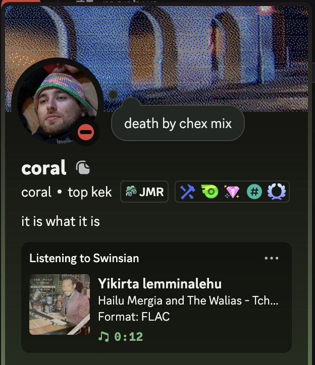

# Swoncord - Discord rich presence for Swinsian

2 years ago I wrote [swinsian-discord-rich-presence](https://github.com/coral/swinsian-discord-rich-presence) which relied on a really jank AppleScript wrapper to pull out status out of Swinsian. Having gained MacOS enlightenment I've come to learn there is this magic notification framework we can use instead to know what tracks are being played. It's now a MacOS menu bar app instead of terminal CLI and it also finds album art using MusicBrainz.

## Building

I'm using `cargo bundle --release` to package the app.

## Diagnostics

Logs are written to `~/Library/Logs/Swoncord/swoncord.log`, including when launched
from Finder or at login. The previous log is kept as `swoncord.previous.log`;
each file rotates at approximately 2 MiB. Logs include album metadata, artwork
lookup results and errors, retries, and Discord failures. They survive restarts.

Artwork lookups run in a helper process with a 45-second deadline. Failed lookups
retry after 30 seconds, backing off to five minutes, without needing a track or
app restart. Switching to a different artist/album cancels the running lookup
and starts the newest album after the one-second request-spacing delay. Songs
on the same artist/album share the in-flight lookup and retry schedule.
Each attempt uses fresh HTTP clients. For additional Discord
response diagnostics when launching from Terminal, set `RUST_LOG=swoncord=debug`.

## Contributing

Just open a PR LUL

## License

WTFPL
